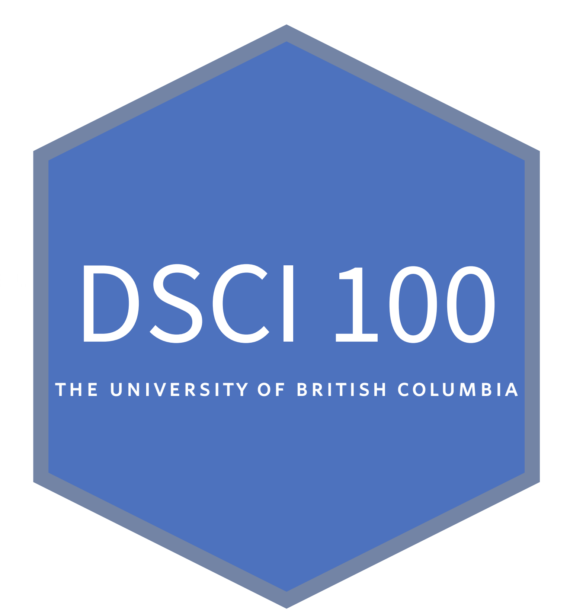
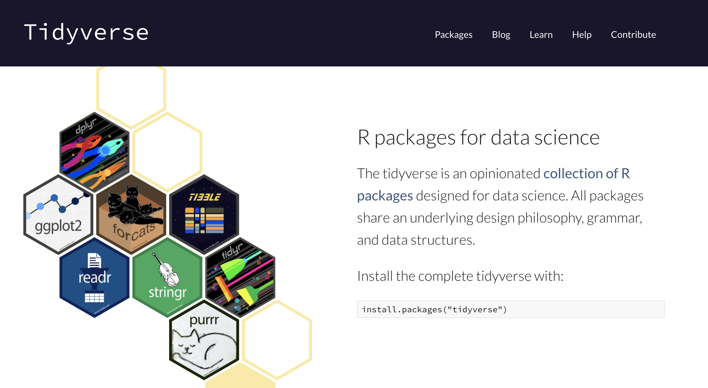
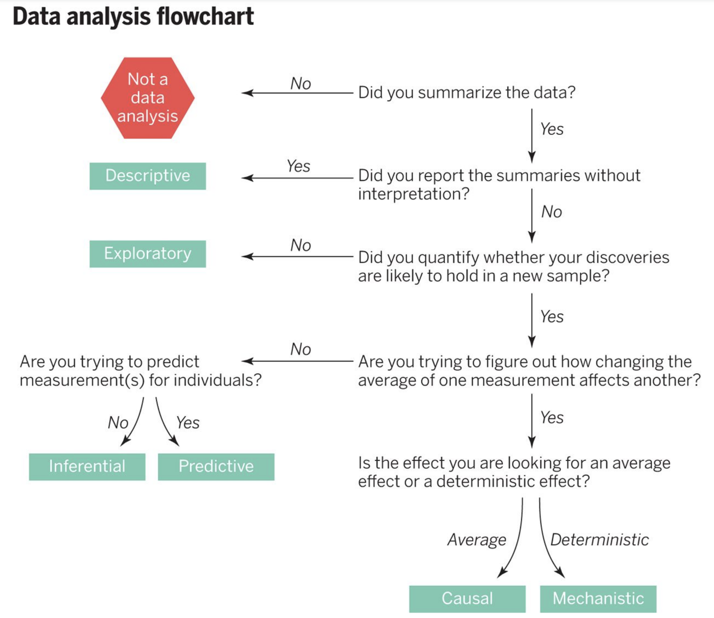
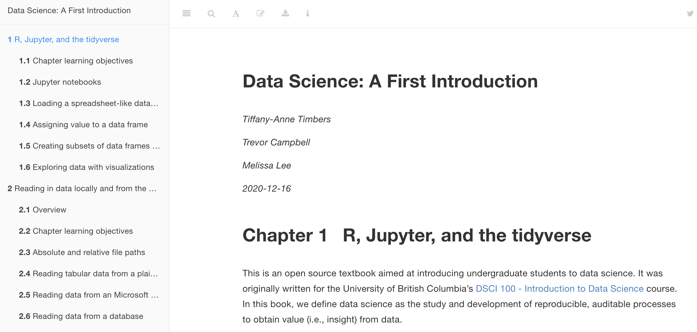
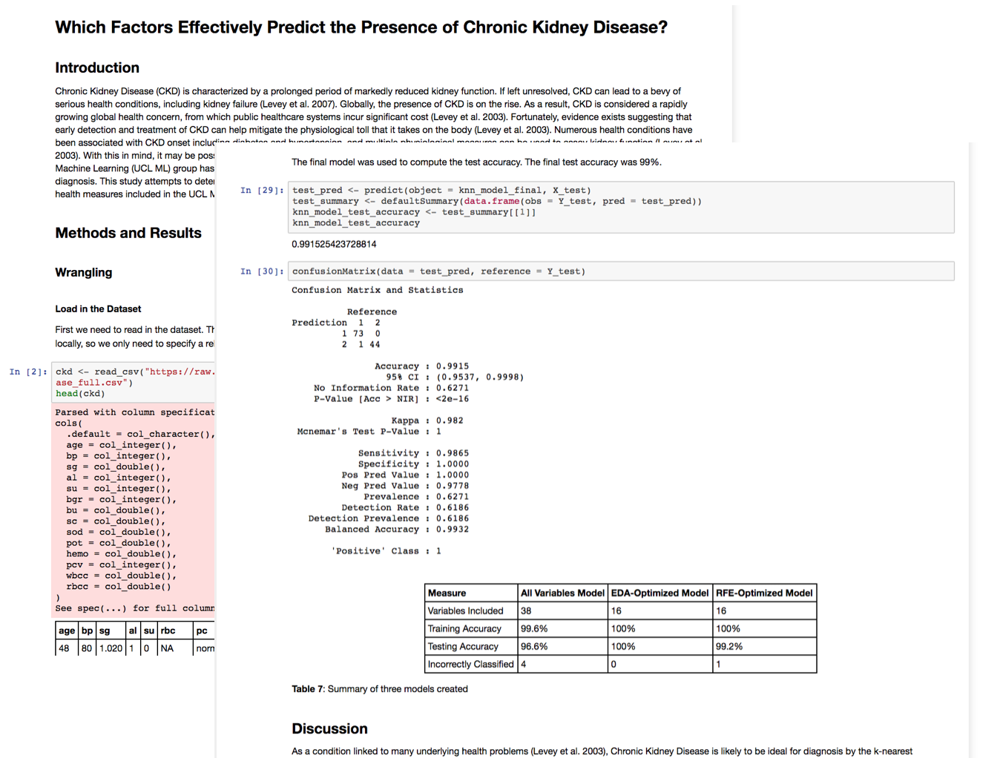

```{r setup, include=FALSE}
library(knitr)
library(lubridate)
library(scales)
library(tidyverse)
knitr::opts_chunk$set(echo = FALSE)
```

class: center, middle

## Course title and calendar Description:

```{r logo, out.width="25%"}

```

### Introduction to Data Science

*Use of data science tools to summarize, visualize, and analyze data. Sensible workflows and clear interpretations are emphasized.*

Prerequisites: Grade 12 Math

Syllabus: [https://ubc-dsci.github.io/dsci-100/README.html](https://ubc-dsci.github.io/dsci-100/README.html)

---

class: middle

## Course history

- Started Development in 2017 by the UBC Department of Statistics

- Course enrollment currently limited by seats offered


```{r enrollments, fig.width = 5, fig.height = 4, fig.retina = 2}
enrollments <- tibble(year = c(2018L, 2019L, 2020L),
                      students = c(59L, 241L, 601L))

ggplot(enrollments, aes(x = year, y = students)) +
  geom_line() +
  geom_point() +
  scale_x_continuous(breaks = c(2018, 2019, 2020),
                     labels = function(x) paste0(round(as.numeric(x)))) +
  xlab("Year") +
  ylab("Number of students enrolled") +
  ylim(c(0, 700)) +
  theme_bw() +
  theme(text = element_text(size = 16)) 
```

---

class: center, middle

## Adopted definition of data science

The process of obtaining value (*i.e.*, insight) from data through reproducible and transparent methods.

<!--- this definition drives how we choose content for this course - content is 
focused on both how to ask and answer statistical questions using appropriate
methods, as well as how to do this in a way that others can see what you have 
done, and use your methods with the same data to obtain the same results --> 


---

class: center

## Course structure

--

First third focuses on how to use the R programming language to load, 
wrangle/clean, and visualize data, while answering descriptive and 
exploratory data analysis questions. 

```{r tidyverse, out.width="60%"}

```

--

The remaining two thirds of the course illustrate how to solve four common 
problems in data science, which are useful for answering predictive and 
inferential data analysis questions.

---

## Statistical questions we focus on

--

- Predicting a class/category for a new observation/measurement (e.g., cancerous or benign tumour)

--

- Predicting a value for a new observation/measurement (e.g., 10 km race time for 20 year old females with a BMI of 25).

--

- Finding previously unknown/unlabelled subgroups in your data (e.g., products commonly bought together on Amazon)

--

- Estimating an average or a proportion from a representative sample (group of people or units) and using that estimate to generalize to the broader population (e.g., the proportion of undergraduate students that own an iPhone)

---

## What is the question

```{r what-is-the-question, out.width="75%"}

```

[*Peng & Leek, Science, 2015*](https://science.sciencemag.org/content/347/6228/1314.summary)

<!---For each of these problems, we map them to the type of data analysis question being asked and discuss what kinds of data are needed to answer such questions (Leek and Peng 2015; Peng and Matsui 2015). More advanced (e.g., causal or mechanistic) data analysis questions are beyond the scope of this text. -->

---

## Course outline

.pull-left[

Data Science workflow:
```{r workflow, out.width="100%"}
include_graphics("https://d33wubrfki0l68.cloudfront.net/795c039ba2520455d833b4034befc8cf360a70ba/558a5/diagrams/data-science-explore.png")
```

*Source: [R for Data Science](https://r4ds.had.co.nz/) by Garrett Grolemund & Hadley Wickham*
]

--

.pull-right[
| Week | Topic |
|------|-------|
| 1 | A vignette |
| 2 | Reading data |
| 3 | Wrangling data |
| 4 | Visualising data |
| 5 | Collaboration & start projects |
| 6 | Classification part I |
| 7 | Classification part II |
| 8 | Regression part I |
| 9 | Regression part II |
| 10 | Work on projects |
| 11 | Clustering |
| 12 | Introduction to statistical inference part I |
| 13 | Introduction to statistical inference part II |
]

<!--- Each week, an entire data analysis is, to quote Jenny Bryan, completed 
from Nachos to cheesecake. -->

---

## Key aspects of the course outline for success:

--

* Learners see & do an entire data analysis in R in week 1! 

--

* Programming skills are taught in the context of simple data analysis

--

* Predictive questions before inferential questions

--

* Repeated emphasis on what is the question, and choosing methods based on the question and data in hand.

---

class: middle, center, inverse

## Key aspects of course organization, mechanics and pedagogy that allow for success


---

class: middle

## Course organization and mechanics

.pull-left[

- Two 90 min meetings a week (lecture + tutorial)

- 3/4 flipped classroom

- paperless course

- ~ 60% of assessments are autograded

]

.pull-right[
| Deliverable | % grade |
|------------|----------|
| Lecture worksheets | 5 |
| Tutorial problem sets | 15 |
| Group project | 20 |
| Two quizzes/exams | 40 |
| Final exam | 20 |
]

---

## Textbook/readings

No modern yet accessible textbooks available that are suitable for our list of topics,
programming language, and target learners... at least that I am aware of...

--

... so we wrote our own using the `bookdown` R package!




- URL: [https://ubc-dsci.github.io/introduction-to-datascience](https://ubc-dsci.github.io/introduction-to-datascience)
- [open source](https://github.com/UBC-DSCI/introduction-to-datascience) and licensed [Attribution-NonCommercial-ShareAlike 4.0 International](https://creativecommons.org/licenses/by-nc-sa/4.0/)
- *To be published in print by CRC Press at some point in 2021*

---

## Lecture worksheets & tutorial homework

.pull-left[

]

.pull-right[
- Jupyter notebooks are literate code documents similar to R Markdown

- Markdown and LaTeX rendering in developing environment makes them easier to read while editing

- notebooks can be manually or autograded using an open source tool, [nbgrader](https://nbgrader.readthedocs.io/en/stable/)

]

Examples of DSCI 100 worksheets: 
- [worksheet_01](https://github.com/UBC-DSCI/dsci-100-assets/blob/master/2020-fall/materials/worksheet_01/worksheet_01.ipynb)
- [worksheet_08](https://github.com/UBC-DSCI/dsci-100-assets/blob/master/2020-fall/materials/worksheet_08/worksheet_08.ipynb)

---

## Group project

End product is a self-contained reproducible data analysis and report inside a Jupyter notebook



---

class: middle

# Reducing barriers to entry and success

- Gender and cultural minorities are under represented in STEM

- Aim: remove as many barriers as possible for entry & success in DSCI 100

---

class: middle
## How? 

- Minimal pre-requisites (MATH 12)


- Anonymous class discussion forum (Piazza)


- Formal and public course code of conduct


- **Web server to provide access to homework via the course learning management system (LMS)!**

---

# Summary

DSCI 100 at UBC:

--

-  a first experience for students to gain skills in the areas of assembling,
analyzing, and interpreting data

--

- by the end of the course, students are able to implement an end-to-end data
science workflow for "simple" questions

--

- emphasis is placed on making analysis reproducible and transparent through the 
use of code in literate code documents (i.e., Jupyter notebooks)

--

- emphasis is also placed on choosing an appropriate method based on "what is the
question" and the data at hand


---

# Acknowledgements

.pull-left[
#### DSCI 100 Development:
- Paul Gustafson
- Matias Salibian-Barrera
- Will Welch
- Nancy Heckman
- Tiffany Timbers
- Melissa Lee
- Samuel Hinshaw
- Melissa Guzman
- Harmeet Gill
- Ian Flores Siaca
]


.pull-right[
#### DSCI 100 Infrastructure:
- Ian Allison 
- Samuel Hinshaw
- The Ha
- Calvin Leung
- Yuvi Pandas

#### DSCI 100 Teaching Team:
- Tiffany Timbers
- Trevor Campbell
- Melissa Lee
- DSCI 100 TAs

]

---

class: center, middle

# Thanks!

```{r logo2, out.width="25%"}

```

Slides created via the R package [**xaringan**](https://github.com/yihui/xaringan).

The chakra comes from [remark.js](https://remarkjs.com), [**knitr**](https://yihui.org/knitr), and [R Markdown](https://rmarkdown.rstudio.com).
